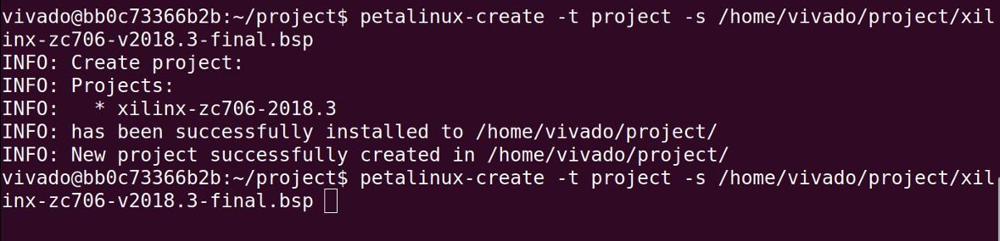

# Installing and Starting with PetaLinux

## 1. Introduction
PetaLinux is a crucial tool for developing embedded Linux systems on Xilinx FPGAs. However, when attempting to download PetaLinux from the official AMD website, I encountered an error due to export compliance verification: 

> “We cannot fulfill your request as your account has failed export compliance verification.”

To overcome this issue, I explored two alternative methods for obtaining and using PetaLinux.

## 2. Method 1: Downloading from Unofficial Website

One approach was to download PetaLinux from an unofficial website. I found a version of PetaLinux 2018 on GetIntoPC.

### 2.1 Steps
1. Download PetaLinux 2018 from the unofficial website.
2. Install and configure all necessary dependencies manually by following the reference guide.
3. Set dash as the default system shell.

### 2.2 Drawbacks
While this method allowed me to get PetaLinux running, it presented several challenges:
- Potential security risks, as the unofficial version may contain viruses.
- Tedious manual setup of dependencies.
- Slow performance if using a virtual machine.
- Unsuitability for product-level development.

## 3. Method 2: Using a Docker Container

The second and more efficient approach involved using a pre-built Docker container available on Docker Hub, which already had PetaLinux installed.

### 3.1 Steps
1. Download the Docker container from Docker Hub.
2. The container includes PetaLinux 2018.3 running on Ubuntu 16.x.
3. All dependencies are pre-installed, saving significant time.

### 3.2 Advantages
This method proved to be superior due to:
- Faster performance compared to a virtual machine.
- No need to change the default shell on the host machine.
- A demo project included for verification.

### 3.3 Demo Project
To ensure everything was working correctly, I built a PetaLinux project using the following command:

```c
petalinux-create -t project -s /home/vivado/project/xilinx-zc706-v2018.3-final.bsp
```

The build process was successful, as shown in the screenshot below:



## 4. Conclusion
Based on my experience, I recommend using the Docker container method for setting up PetaLinux, especially for product-level development. It is faster, more secure, and eliminates the need for manual dependency setup.
