# Vivado Tutorial

## Table of Contents
- [Vivado Installation](#vivado-installation)
- [Vivado Workflow](#vivado-workflow)

## Vivado Installation

We encountered problems downloading Vivado due to license errors, so we created a workaround.  
Download Vivado from this link: **[LINK](https://getintopc.com/softwares/design/xilinx-vivado-design-suite-2018-free-download/)**

## Vivado Workflow

1. **Create a new RTL project.**  
   
   
2. **Choose our board**, which is the ZYNQ-7 ZC702 Evaluation Board.

3. **Create a Block Design** (found in the Flow Navigator section under the IP Integrator category).  
   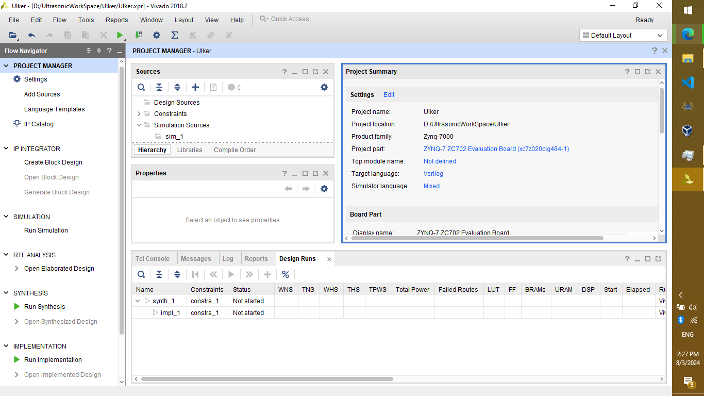

4. **In the Block Design section,** within the Diagram area, add a Zynq-7 Processing System.  
   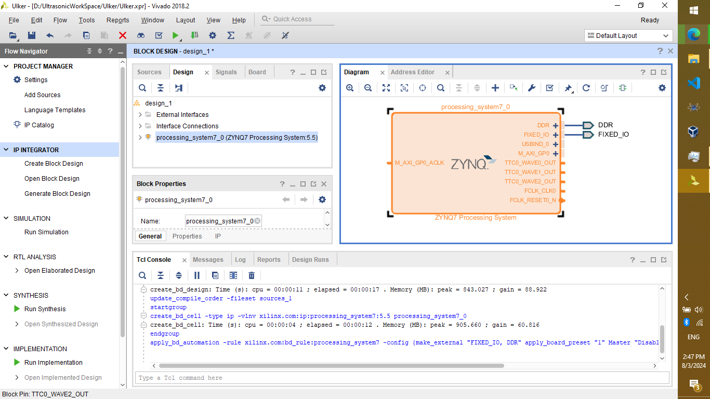

5. **Click on "Run Block Automation"** (found as a hyperlink in the same area of the board diagram), and press Next.  
   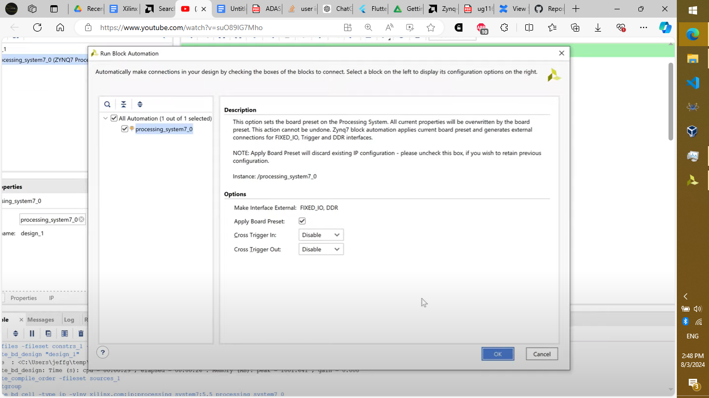

6. **Press on Validate.** You will see an error since we did not configure the `M_AXI_GP0_ACLK` clock. Connect it to `FCLK_CLK0` for now, then validate again. The validation should be successful.  
   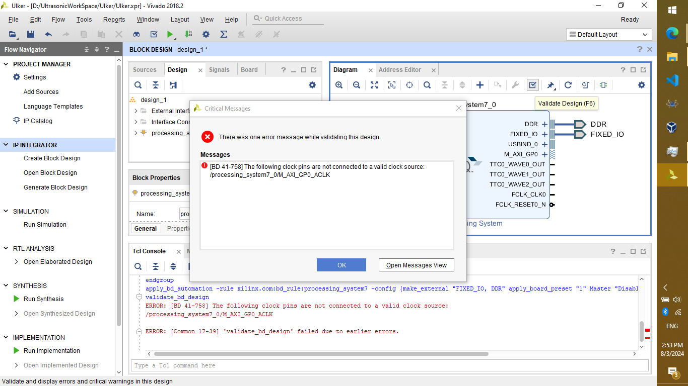  
   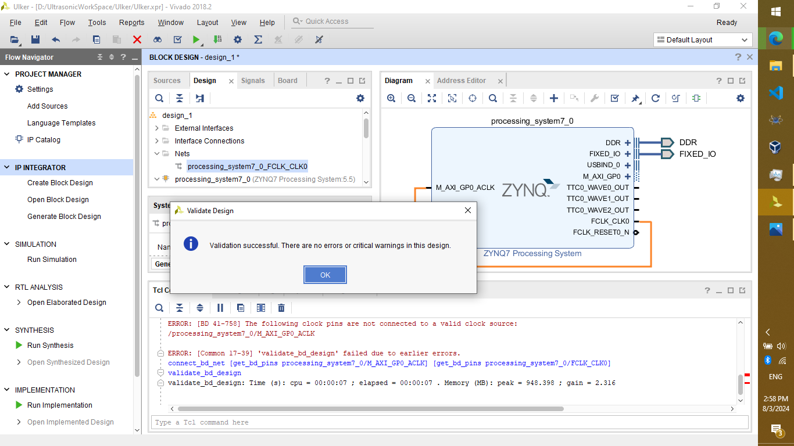

7. **Right-click on your design** under the Design Sources section, select "Create HDL Wrapper," and press OK.  
   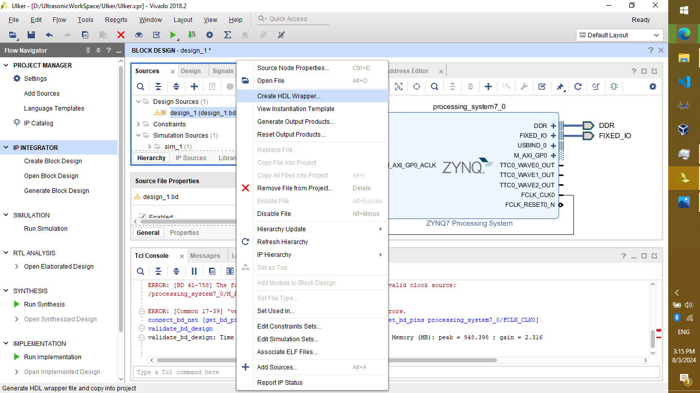

8. **Click on your design wrapper** to view the Verilog code.

9. **From the Program and Debug category** under the Flow Navigator section, click on "Generate Bitstream" and press OK until the generation is complete.  
   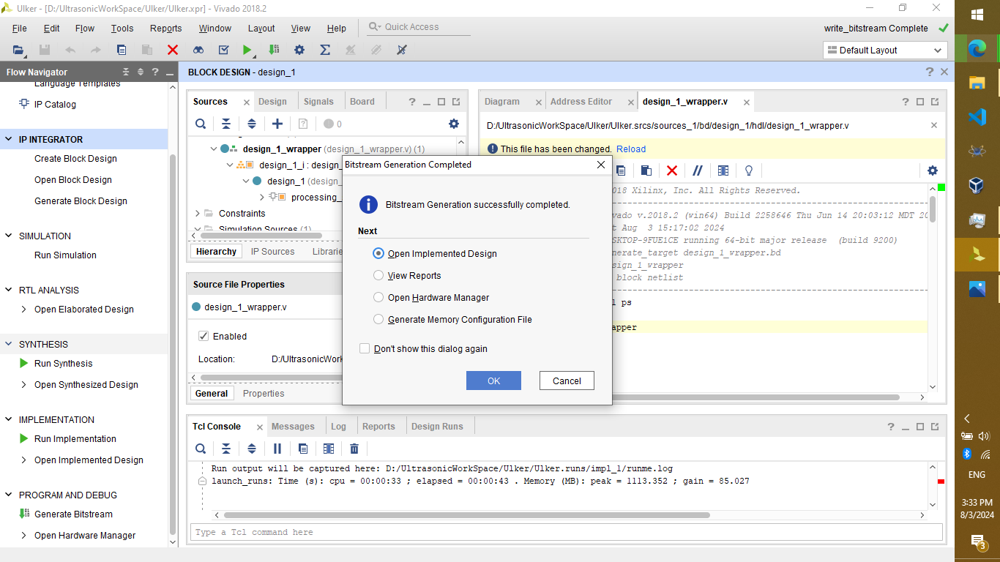

10. **Export the hardware** from the "File" menu in the top bar, check the "Include Bitstream" option, and press Enter.  
    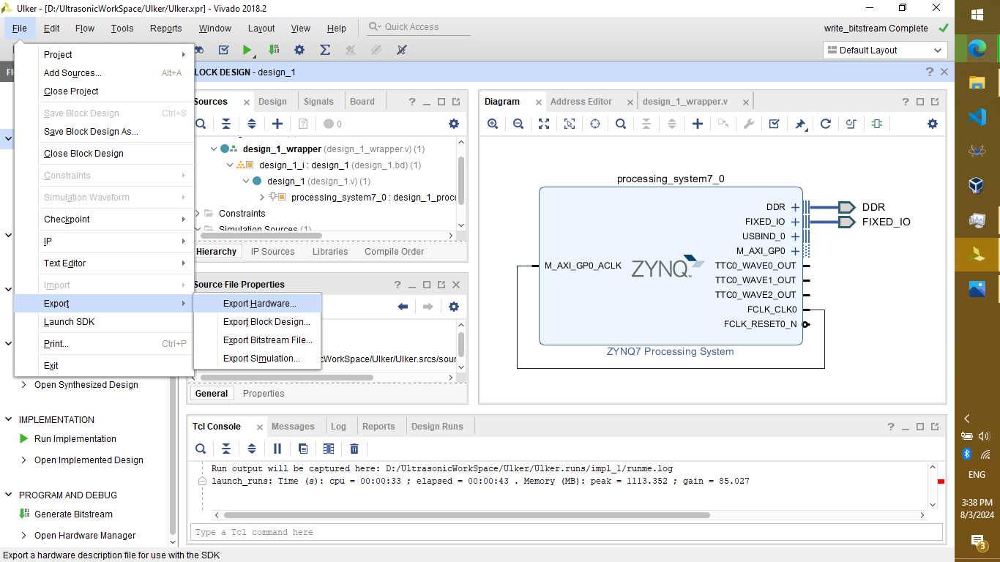  
    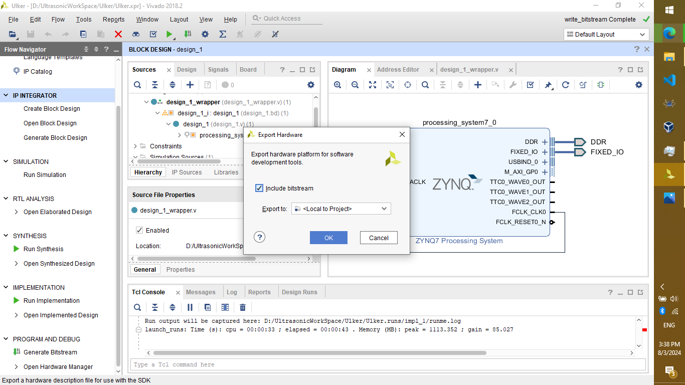

11. **Launch SDK** from the "File" menu in the top bar.  
    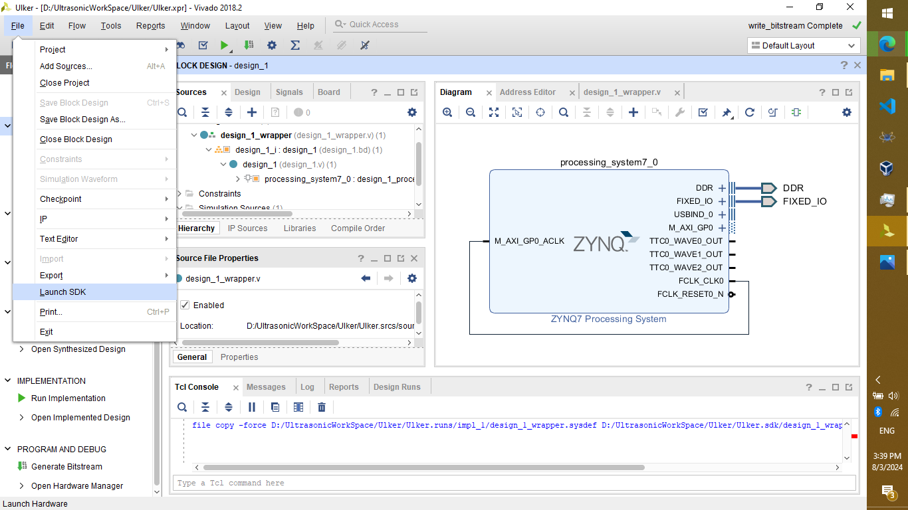

12. **Eclipse will open** containing your SDK, ready for editing.  
    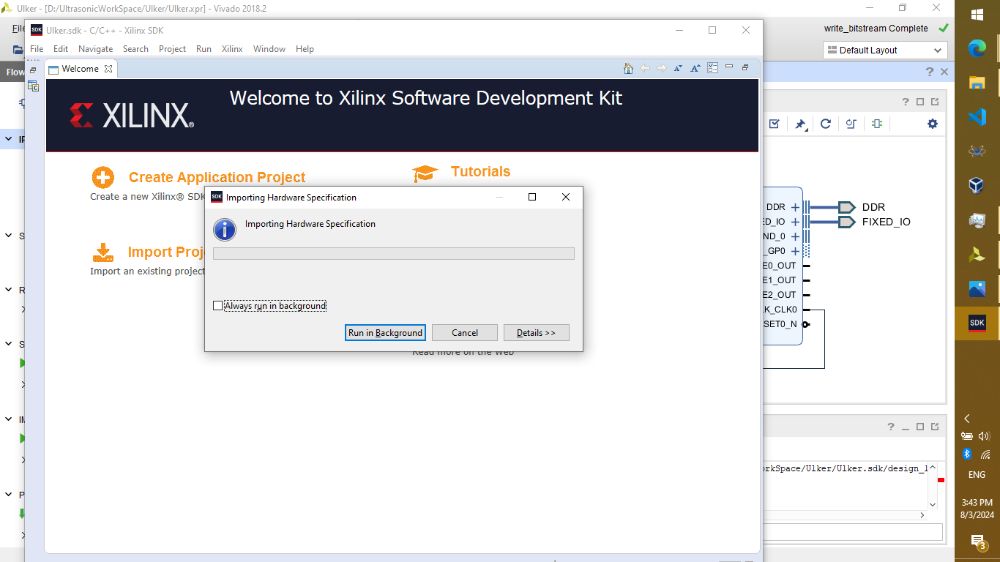

13. **From the "File" menu,** choose "Create New Application Project."  
    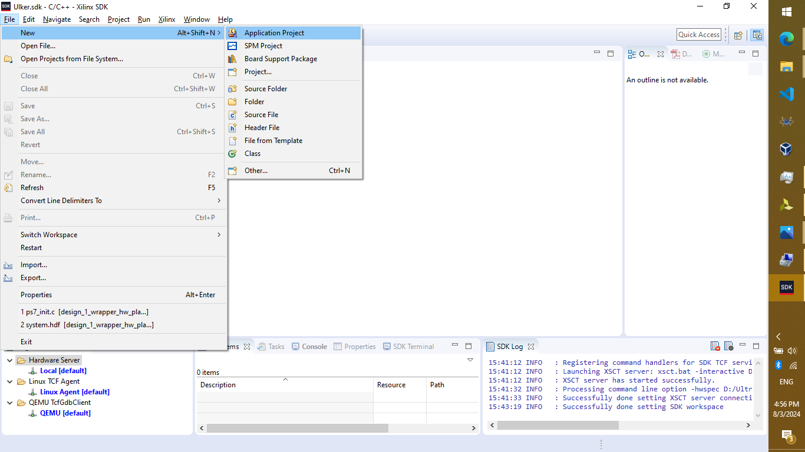

14. **Name the project,** choose the OS as "standalone" for now, and press Next.  
    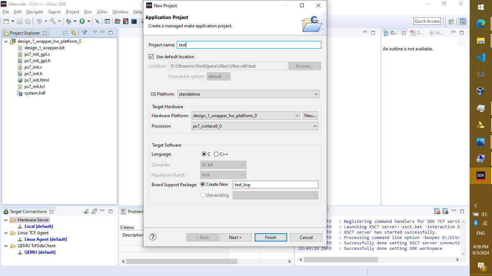

15. **Choose "Hello World"** in C from the available templates.  
    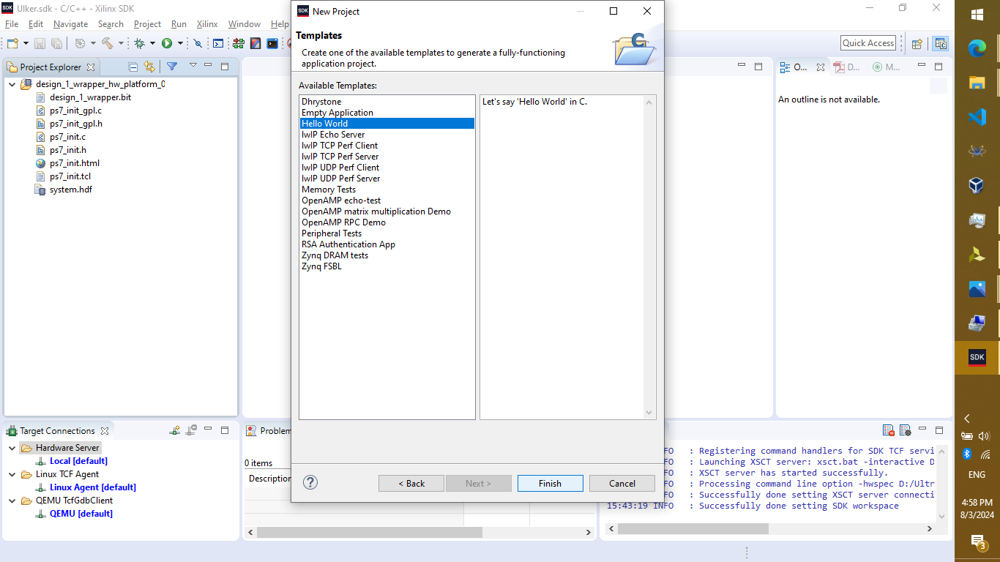

16. **The project will build.**

17. **If you encounter the error** "The application was unable to start correctly (0xc0000142)," like we did, uninstall WinAVR and rebuild the project.  
    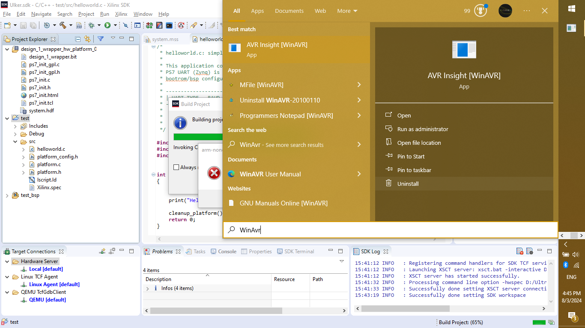  
    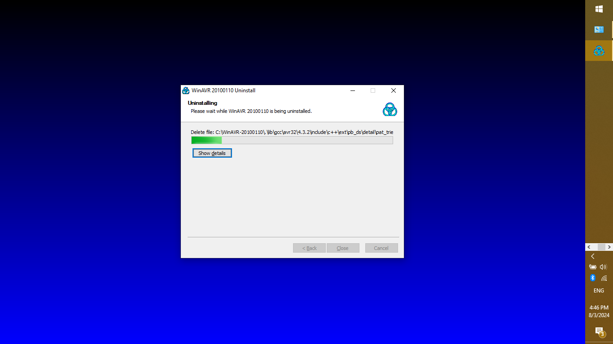

18. **It should build correctly now.** If you encounter any other errors, congratulations, you have faced a problem we didn't!  
    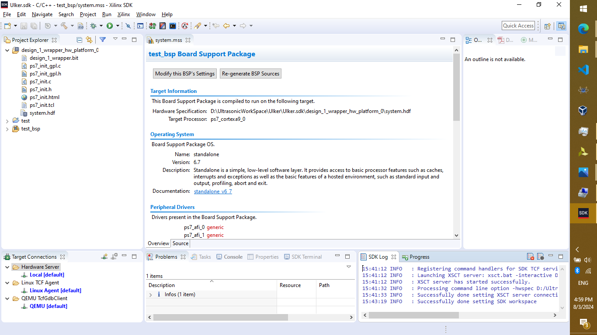

